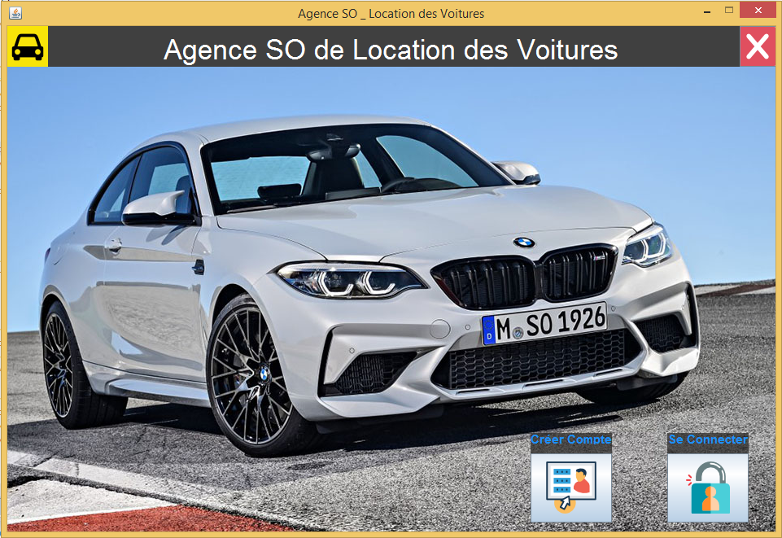
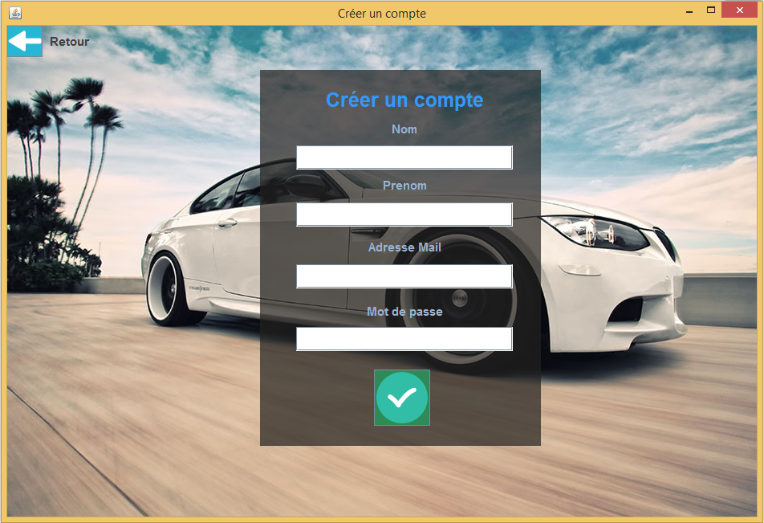
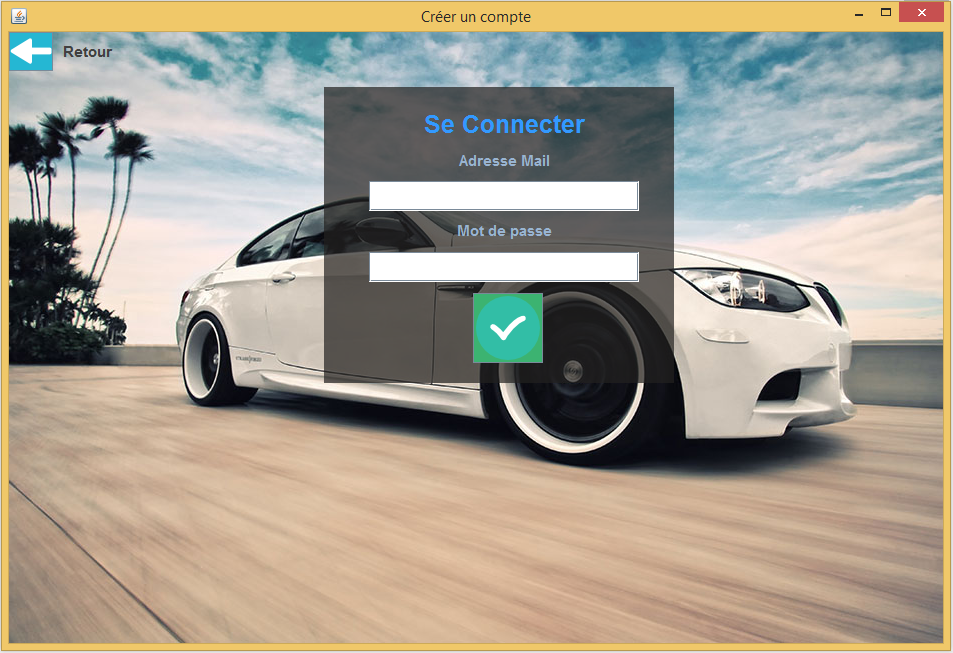
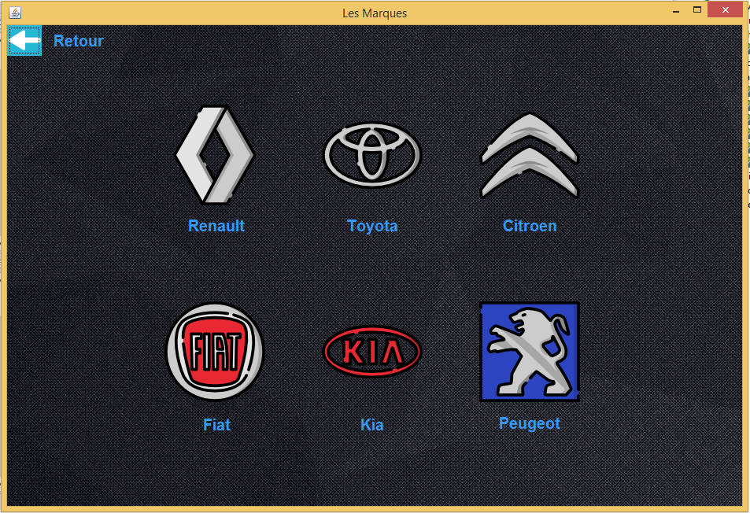
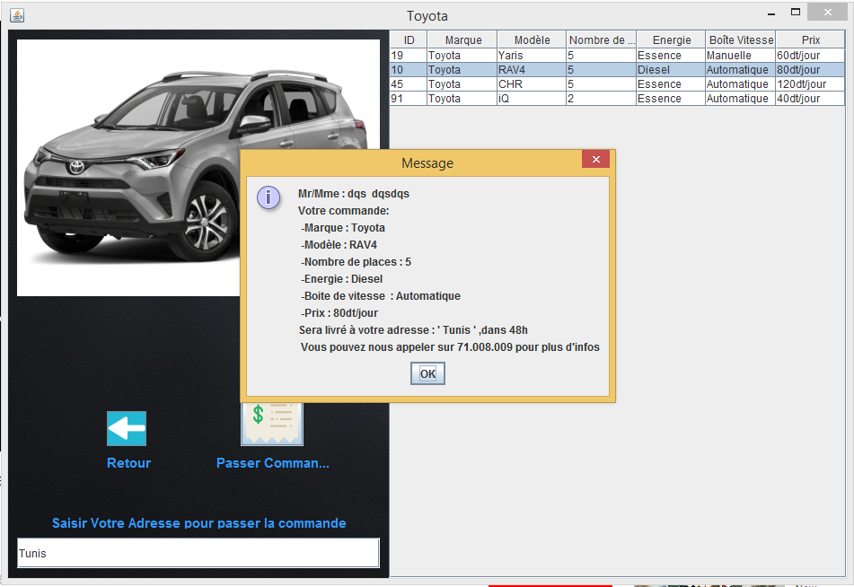
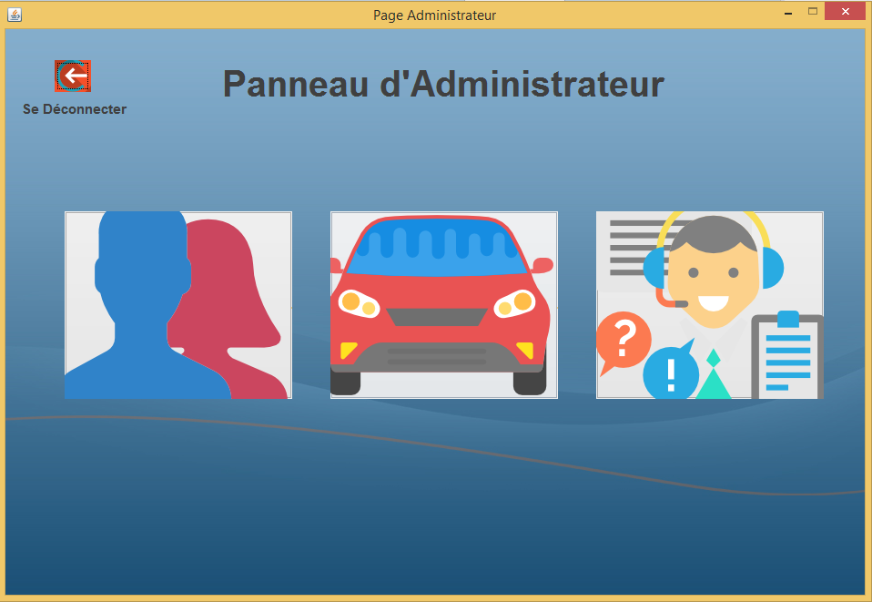
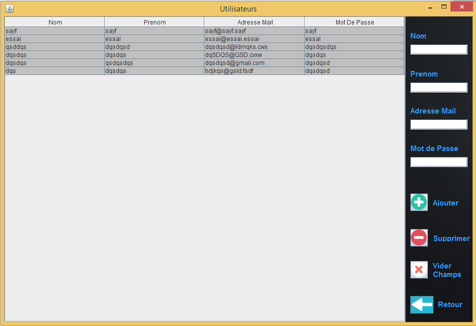
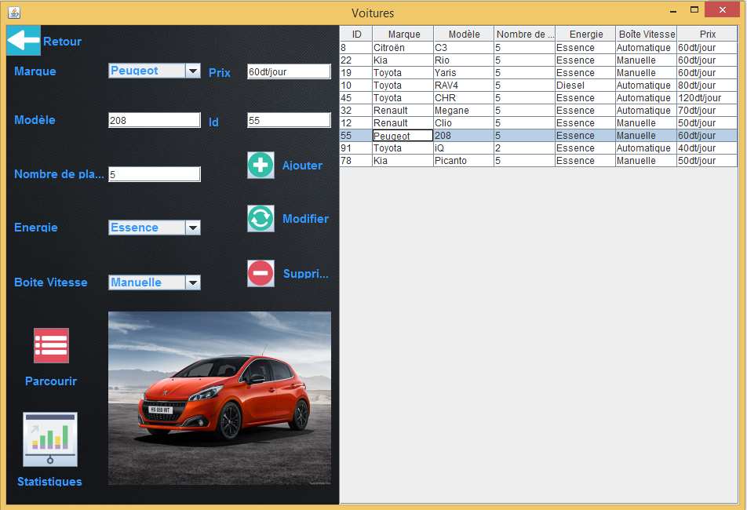
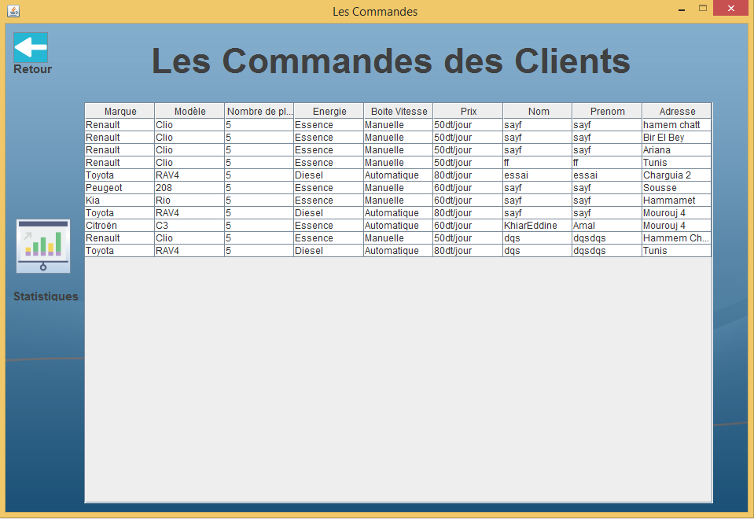
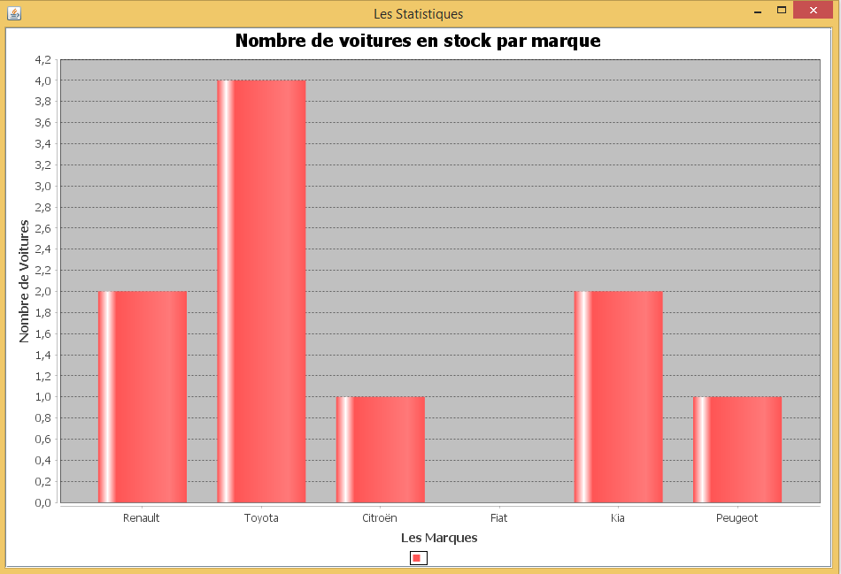

## How to run the application ? 

<ul>
<li>Create a local server using for example WampServer ,Xampp, Phpmyadmin ...</li>
<li>Create a database named 'agence_so' where the pseudo name is 'root' and the password is '' (nothing) </li>
<li>Upload the 'agence_so.sql' file to generate tables </li>
<li>You can now launch direct the application from the .exe file or compile java files</li>
</ul>

## Demos

### Home Page 

You can :

<ul>
  <li>Create an account</li>
  <li>Login </li>
</ul>

     
     
### Create an account

     
###  Login Page 

<ul>
  <li>You can login as a simple user by introducing your email adress and password recently created or existed in the database</li>
  <li>You can login as an admin by introducing 'root' in both email adress and password</li>
</ul>

     
### If you login  as a simple user you should

<ul>
  <li> Pick a brand
      
  </li>
  <li> Pass a command
    
  </li>
</ul>

### If you login  as an admin 

     
### You can manage users

     
### Manage stock

     
### Consult passed commands

     
### In these sub_panels you can generate some statistics

